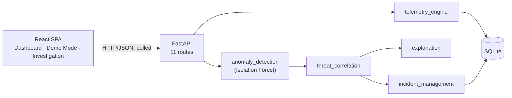

# SentinelX

Behavioural compromise detection for endpoints, firewalls, and routers — flags what's *unusual
for a specific host*, not just what matches a known-bad signature.

> Built for a Smart India Hackathon internal prototype. All telemetry, endpoints, and incidents
> in this system are **synthetically generated** and clearly labelled as such everywhere they
> appear — no real network or host data is collected or processed. Full technical detail lives in
> [`docs/ARCHITECTURE.md`](docs/ARCHITECTURE.md); this document is the practical overview.

## Problem

Traditional detection — antivirus signatures, hash blocklists, known-bad IP/domain feeds — only
catches attacks someone has already seen and catalogued. It structurally misses:

- **Novel or zero-day techniques** with no existing signature.
- **Living-off-the-land attacks** that use legitimate admin tools and valid credentials, so
  nothing on disk or in a packet ever matches a "known-bad" pattern.
- **Insider misuse**, where the actor and the credentials are entirely legitimate — there is no
  IoC to match in the first place.

Relying solely on IoC matching means the defender is always at least one incident behind the
attacker: something has to be seen and catalogued *somewhere* before a signature can exist for
it.

## Solution

SentinelX detects deviation from a host's own **learned behavioural baseline**, then requires
**multiple independent signals** to move together before treating that deviation as meaningful,
and finally turns every score into a **concrete, evidence-based explanation**:

1. **Behavioural anomaly detection** — an Isolation Forest learns what "normal" looks like *per
   host* (a firewall's normal traffic volume is a workstation's extreme outlier, and vice versa),
   then scores new telemetry against that host's own history — not a fixed global threshold and
   not a signature list.
2. **Multi-signal correlation** — a single unusual metric is common noise. Risk only escalates
   once several independent signal families (traffic volume, DNS behaviour, process creation,
   authentication, destination diversity, resource usage) deviate together.
3. **Explainable output** — every risk score traces to the literal evidence behind it: the
   observed value, the learned baseline, the deviation in standard deviations, and each signal's
   share of the finding. Nothing is asserted that isn't computed from real telemetry — the system
   never invents a malware name, a CVE, or an attack technique.

## Features

- Live synthetic telemetry for 5 simulated hosts (2 workstations, 1 firewall, 1 router, plus a
  designated compromise-simulation target), continuously generated with realistic correlated
  variation, not independent random noise.
- Per-host ML anomaly scoring (Isolation Forest) with a 0–100 normalized score.
- Rule-based multi-signal correlation producing a `compromise_probability` and a 4-tier severity
  (low / medium / high / critical), collapsed to a 3-tier **Normal / Suspicious / High Risk**
  vocabulary in the UI.
- Deterministic, template-based explanation generation — real evidence, never a black box, no LLM
  dependency.
- A persisted incident lifecycle (`OPEN → INVESTIGATING → RESOLVED`) with automatic, deduplicated
  incident creation and a full audit trail.
- A SOC-style dashboard (fleet summary, threat timeline, risk distribution, incident feed,
  endpoint table) and a per-host investigation drawer that is the most detailed view in the app.
- A controlled, reversible **compromise simulation** with a one-click reset, and a guided **Demo
  Mode** that narrates a live detection end to end using real API calls.

## Architecture

Single FastAPI process (Python) backed by SQLite, serving a React SPA. No message queue, no
separate ML microservice — the anomaly model is an in-memory singleton inside the API process,
trained at startup and periodically retrained by the same background loop that generates
telemetry.



See [`docs/ARCHITECTURE.md`](docs/ARCHITECTURE.md) for the full component diagram, sequence
diagrams for both data flows, and the incident-lifecycle state diagram.

## Technology Stack

| Layer | Technology |
|---|---|
| Backend | Python 3.13, FastAPI, Pydantic, Uvicorn |
| ML | scikit-learn (`IsolationForest`), NumPy, pandas |
| Database | SQLite |
| Frontend | React 19, TypeScript, Vite, Tailwind CSS v4, Recharts, Axios |
| Testing | pytest (backend, 53 tests), oxlint + `tsc` (frontend) |

## How It Works

1. **Telemetry generation** — a background loop appends one realistic telemetry sample per host
   every few seconds (CPU, memory, connections, in/out bytes, DNS queries, failed/successful
   logins, new processes, unique destinations), driven by a smooth per-host random walk so
   metrics move together the way a real host's load does.
2. **Per-host baseline** — for each host, the mean and standard deviation of its own normal
   history is computed per feature. A new sample is converted to a z-score against *that host's*
   baseline, not a global one.
3. **Anomaly scoring** — the z-score vector is scored by a single Isolation Forest trained across
   all hosts' normalized data, then linearly rescaled to 0–100.
4. **Correlation** — features with |z-score| ≥ 2 are "significant." Only when at least two
   signals are significant *together* does the correlation layer add to the score — this is the
   concrete implementation of "a single unusual metric is noise."
5. **Explanation** — the same significant signals become structured evidence (observed value,
   baseline, deviation, contribution %) and a template-generated summary.
6. **Incident** — once the combined `compromise_probability` crosses a threshold, an incident is
   opened once (deduplicated against any already-active incident for that host) with a full
   snapshot of the evidence, and stays open until explicitly resolved.

## Demo

A **controlled, fully reversible compromise simulation** — no real exploitation, network scanning,
or destructive action of any kind. Triggering it deterministically shifts a target host's telemetry
across six independent signal families at once (outbound traffic, DNS query volume, process
creation, failed authentication, destination diversity, CPU/memory), which is exactly the pattern
the correlation layer is built to catch.

- **Simulate Compromise** — one API call that immediately writes a genuinely anomalous telemetry
  sample and lets the normal detection pipeline (unmodified) pick it up.
- **Demo Mode** — a guided, presentation-friendly walkthrough of the same trigger, narrating real
  API responses stage by stage (telemetry anomaly → **BEHAVIOURAL ANOMALY DETECTED** → **MULTIPLE
  SIGNALS CORRELATED** → **POSSIBLE SYSTEM COMPROMISE** → **HIGH RISK INCIDENT** → explanation).
  The pacing between stages is presentational only — every value shown is a real, freshly-fetched
  API response, not a scripted animation.
- **Reset** — restores normal telemetry and, in Demo Mode, also resolves any incident left open
  so the exact same sequence can be run repeatedly and reliably during a live presentation.

## Running Locally

### Backend

```bash
cd backend
python -m venv .venv
./.venv/Scripts/pip install -r requirements.txt   # Windows; use .venv/bin/pip on macOS/Linux
uvicorn app.main:app --reload --port 8000
```

API docs (Swagger UI): http://localhost:8000/docs

Run the test suite:

```bash
./.venv/Scripts/python -m pytest -v
```

### Frontend

```bash
cd frontend
npm install
npm run dev
```

App: http://localhost:5173 — configure the API base URL via `frontend/.env` (see
`.env.example`).

```bash
npm run build   # production build
npm run lint    # oxlint
```

## API

All routes are prefixed with `/api`. Every response includes a `notice` field restating that the
data is synthetic.

| Method | Path | Purpose |
|---|---|---|
| GET | `/api/health` | Liveness and version check |
| GET | `/api/endpoints` | List the 5 simulated hosts |
| GET | `/api/endpoints/{hostname}` | Single host detail |
| GET | `/api/telemetry/{hostname}` | Telemetry history (`?limit=`) |
| GET | `/api/endpoints/{hostname}/risk` | Live anomaly score + compromise probability |
| GET | `/api/endpoints/{hostname}/explanation` | Live evidence-based explanation |
| GET | `/api/incidents` | List incidents (`?status=OPEN\|INVESTIGATING\|RESOLVED`) |
| GET | `/api/incidents/{incident_id}` | Single incident |
| PATCH | `/api/incidents/{incident_id}` | Change incident status |
| POST | `/api/simulation/compromise` | Trigger the compromise simulation (`?hostname=`, default `HOST-042`) |
| POST | `/api/simulation/reset` | Restore all hosts to normal telemetry |

## ML Methodology

**Isolation Forest** (`scikit-learn`), fit once per training call, per-host z-score normalized:

1. For every host, compute the mean and standard deviation of its own normal-labelled telemetry,
   per feature.
2. Convert every sample — training or live — into a z-score vector using *that sample's own
   host's* baseline. This is what lets one shared model work across a fleet where a firewall's
   normal traffic volume is a workstation's extreme outlier: both are expressed in the same unit,
   "standard deviations from this host's own normal."
3. Fit `IsolationForest(n_estimators=200, max_samples="auto")` on the pooled z-score matrix from
   all hosts.
4. Score a new sample as `-model.score_samples(z_vector)` (higher = more anomalous), then
   linearly rescale to 0–100, anchored on the **median** (→ 0, "typical") and **maximum** (→ 100)
   raw score observed on the training set. A percentile-rank scheme was tried first and rejected:
   with only tens of samples per host, it made ordinary normal telemetry swing wildly between
   consecutive readings, because raw scores for unremarkable points cluster tightly and rank
   amplifies noise within that cluster.
5. The model is retrained periodically (in addition to at startup) on all telemetry currently
   labelled normal, so the baseline absorbs newly-observed legitimate variation instead of
   staying frozen at the first snapshot.

**Ground-truth labels are used only to curate training data, never at inference.** The simulation
knows which samples are genuinely anomalous, and that label decides what goes *into* the training
set — the model itself never sees it and never uses it to score a sample.

**A real, measured limitation**: with only tens of training samples per host, this model reliably
detects anomalies that are extreme across *several* features at once, but is measurably weaker at
detecting an anomaly confined to a single feature out of nine. This is exactly why the correlation
layer exists as an independent second check rather than trusting the raw ML score alone — it isn't
a stylistic choice, it's a compensations for a characterized model weakness.

No accuracy, precision, or recall figure is reported anywhere in this project. The system has
ground-truth labels available for its own synthetic data, but they are used solely to curate
training data — no formal evaluation against a held-out labelled set has been performed, so no
performance number is claimed.

## Limitations

Stated plainly:

- **Synthetic telemetry only.** There is no real network or endpoint data ingestion path in this
  MVP — every signal is generated, not captured.
- **No accuracy claim.** See above — this has not been formally evaluated against a labelled
  test set.
- **No authentication, authorization, or rate limiting** anywhere in the API.
- **Single SQLite file, single process.** No horizontal scaling, no replication.
- **False positives are reduced, not eliminated.** The realistic (correlated, non-independent)
  telemetry generator can occasionally push an untouched host's score into "medium" or "high"
  territory by chance; this was observed and documented during testing, and self-corrects within
  seconds, but is not fully eliminated by design.
- **Correlation-layer weights are heuristic**, hand-set and documented as such — not fitted or
  validated against a labelled dataset.
- **No time-series storage of risk scores** — `/risk` is always computed fresh from the latest
  telemetry row; only telemetry history and incident snapshots are persisted.
- **Polling, not push** — the frontend refreshes every 7 seconds; there is no WebSocket/SSE
  channel.

Full list, with more detail on each point: [`docs/ARCHITECTURE.md` §16](docs/ARCHITECTURE.md#16-current-mvp-limitations).

## Future Scope

- **Public cybersecurity datasets** (e.g. CICIDS2017/2018, UNSW-NB15, NSL-KDD, or real anonymized
  SOC data) to replace synthetic telemetry for training and, critically, to enable a genuine
  precision/recall evaluation before any performance claim is made.
- **Richer endpoint telemetry** — process trees, file system and registry events, EDR-grade
  signals, and raw packet/flow data, rather than the 9 aggregate metrics used today.
- **Temporal models** — sequence models (e.g. LSTM/Transformer-based anomaly detection) to catch
  attack *patterns* over time, not just single-sample deviation, and to reconstruct attack chains
  across hosts.
- **Enterprise deployment** — multi-tenant data isolation, RBAC/SSO, a real streaming ingestion
  pipeline, and horizontal scaling of the API and scoring layers.
- **Online learning** — incremental/streaming model updates in place of the current periodic
  batch retrain, so the baseline adapts continuously rather than in fixed windows.
- **Federated learning** — training baselines across multiple organizations' telemetry without
  any raw data leaving its origin, for detection that benefits from broader signal without
  centralizing sensitive data.
- **SIEM/EDR integration** — outbound connectors (webhooks, Splunk/Sentinel/SOAR APIs) so incidents
  and evidence flow into the tools a real SOC already uses, instead of living only in this
  dashboard.
