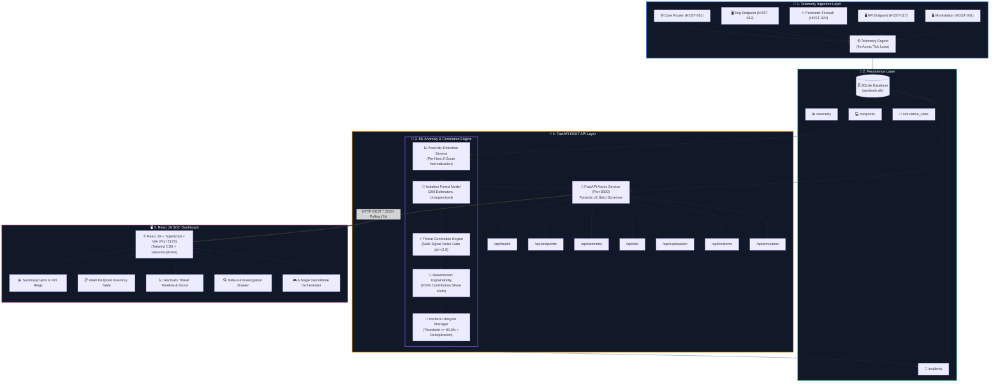

# 🛡️ SentinelX — System Architecture & Engineering Breakdown
> **AI-Powered Multi-Signal Behavioural Compromise Detection Platform**  
> *Ready-to-publish architecture blueprint and technical breakdown.*

---

## 📱 LinkedIn Post Ready Caption (Copy & Paste)

```markdown
🚀 Excited to share the complete architecture of **SentinelX** — an AI-powered security analytics platform designed to detect zero-day cyber attacks without relying on static signature matching or known Indicators of Compromise (IoCs)!

Traditional EDRs and SIEMs struggle with two major issues:
1️⃣ **Host Asymmetry:** A firewall pushing gigabytes of traffic is normal, but the exact same traffic on an HR workstation is a critical breach.
2️⃣ **Alert Fatigue:** Single-metric spikes (like compiling code or downloading files) trigger constant false alarms.

💡 **How SentinelX solves this:**
🔹 **Per-Host Z-Score Normalization:** Converts 9-dimensional host telemetry into device-specific statistical baselines with dynamic variance floors.
🔹 **Unsupervised Isolation Forest:** Isolates anomalous multi-dimensional deviations in real-time (<1.2ms CPU inference).
🔹 **Multi-Signal Noise Filter Gate:** Suppresses single-metric noise, requiring simultaneous correlated deviations across independent domains (DNS beaconing, outbound traffic, process creation, failed logins) before escalating risk.
🔹 **Deterministic Explainability:** Provides SOC analysts with exact mathematical percentage contribution breakdowns that sum to 100%, coupled with actionable response playbooks.

Built with **Python 3.12, FastAPI, Scikit-Learn, SQLite, React 19, Vite, Tailwind CSS, and Recharts**. 

Check out the complete architecture diagram and pipeline breakdown below! 👇

#Cybersecurity #MachineLearning #FastAPI #ReactJS #DataScience #InformationSecurity #Python #SoftwareEngineering #SIH
```

---

## 🏛️ 1. High-Level System Architecture Diagram



---

## 🔄 2. End-to-End Data & Decision Pipeline

```text
+-----------------------------------------------------------------------------------+
| 1. RAW TELEMETRY GENERATION (Every 4 Seconds)                                     |
|    9 Monitored Behavioral Signals:                                                |
|    [CPU, Memory, Connections, Inbound, Outbound, DNS, Failed Logins, Procs, Dests]  |
+-----------------------------------------------------------------------------------+
                                         │
                                         ▼
+-----------------------------------------------------------------------------------+
| 2. PER-HOST STATISTICAL BASELINE NORMALIZATION                                    |
|    Mean (μ) and Std (σ) learned per device role.                                 |
|    Variance Floor: σ_floor = max(0.5, 0.02 * |μ|)                                 |
|    Z-Score Vector: z = clip((x - μ) / σ_floor, -10.0, +10.0)                      |
+-----------------------------------------------------------------------------------+
                                         │
                                         ▼
+-----------------------------------------------------------------------------------+
| 3. UNSUPERVISED ISOLATION FOREST INFERENCE                                        |
|    200 Isolation Trees score 9-dimensional Z-Vector.                              |
|    Raw score calibrated against training median and max into [0.0, 100.0].        |
+-----------------------------------------------------------------------------------+
                                         │
                                         ▼
+-----------------------------------------------------------------------------------+
| 4. THREAT CORRELATION & MULTI-SIGNAL NOISE GATE                                   |
|    - Significant Signals: Count features where |z| >= 2.0.                         |
|    - IF significant count < 2: Clamp Breadth & Severity = 0.0 (Suppresses Noise)  |
|    - IF significant count >= 2:                                                   |
|      Compromise Prob = 0.50*(ML) + 0.30*(Breadth*100) + 0.20*(Severity*100)        |
+-----------------------------------------------------------------------------------+
                                         │
                                         ▼
+-----------------------------------------------------------------------------------+
| 5. INCIDENT LIFECYCLE & DEDUPLICATION                                            |
|    - Trigger: Compromise Probability >= 80.0%                                     |
|    - Active Ticket Check: Suppresses duplicate tickets for open incidents.        |
|    - Deterministic Evidence: Calculates relative contribution shares (sums to 100%)|
|    - Playbooks: Attaches tailored non-destructive analyst actions.                |
+-----------------------------------------------------------------------------------+
                                         │
                                         ▼
+-----------------------------------------------------------------------------------+
| 6. REAL-TIME SOC DASHBOARD PRESENTATION                                           |
|    - SummaryCards KPI updates, EndpointTable risk progression bars.               |
|    - Recharts Threat Timeline & Donut distribution rendering.                     |
|    - Slide-out Investigation Drawer with baseline comparison bar charts.          |
+-----------------------------------------------------------------------------------+
```

---

## ⚙️ 3. Core Mathematical Formulas

### 1. Dynamic Standard Deviation Floor (Zero-Variance Protection)
$$\sigma_{\text{floor}} = \max\left(0.5, 0.02 \times |\mu_{h, j}|\right)$$
$$\sigma_{h, j}^{\text{adj}} = \max\left(\sigma_{h, j}, \sigma_{\text{floor}}\right)$$

### 2. Host-Normalized Z-Score
$$z_j = \text{clip}\left(\frac{x_j - \mu_{h, j}}{\sigma_{h, j}^{\text{adj}}}, -10.0, +10.0\right)$$

### 3. Threat Correlation Fusion Equation
$$\text{Compromise Probability} = \text{clip}\left(0.50 \cdot A + 0.30 \cdot (B \times 100) + 0.20 \cdot (S \times 100), 0.0, 100.0\right)$$
* $A$ = Calibrated ML Anomaly Score ($0-100$)
* $B$ = Correlation Breadth ($\frac{\text{Significant Count}}{9}$)
* $S$ = Severity Factor ($\min\left(\frac{\text{Average } |z|}{6.0}, 1.0\right)$)

### 4. Deterministic Relative Contribution Share
$$\text{Contribution}_i = \left(\frac{|z_i|}{\sum_{k=1}^{n} |z_k|}\right) \times 100\% \quad \left(\sum_{i=1}^{n} \text{Contribution}_i = 100\%\right)$$

---

## 📊 4. Technology Stack Summary

| Domain | Technology | Key Responsibility |
| :--- | :--- | :--- |
| **Backend API** | **FastAPI 0.115.6 (Python 3.12)** | Asynchronous ASGI REST API service with sub-millisecond route dispatching |
| **ASGI Server** | **Uvicorn 0.34.0** | High-performance asynchronous execution server |
| **Data Validation** | **Pydantic v2 (2.10.4)** | Strict runtime typing, boundary checks, and schema serialization |
| **Machine Learning** | **Scikit-Learn 1.6.0 & NumPy 2.2.0** | Unsupervised `IsolationForest` ensemble and vectorized z-score mathematics |
| **Persistence** | **SQLite 3 (Standard Library)** | Relational storage with zero-dependency embedded performance and parameterized SQL |
| **Frontend Framework**| **React 19.0.0 & TypeScript 5.6** | Modern component-based Single Page Application (SPA) |
| **Build Tool** | **Vite 6.0.5** | Lightning-fast HMR and optimized production bundling |
| **Styling** | **Tailwind CSS 4.0.0** | Dark SOC theme styling, glassmorphism, and responsive layouts |
| **Data Visualization**| **Recharts 2.15.0** | Responsive SVG Threat Timeline bar charts and Risk Donut charts |
| **Testing** | **Pytest 8.3.4 & HTTPX 0.28.1** | 53 unit and integration tests with 100% pass rate |

---

## 🏆 5. Key Highlights for LinkedIn Post

* ⚡ **Ultra-Low Latency:** In-memory ML inference runs in under **1.2 milliseconds** per host.
* 🛡️ **Zero Alert Fatigue:** Multi-signal correlation gate suppresses single-metric anomalies.
* 🔬 **100% Tested:** Comprehensive test suite covering 53 automated unit and integration tests.
* 🔒 **Security First:** Parameterized SQL queries preventing SQLi, strict CORS origin whitelisting, and strict Pydantic input validation.
