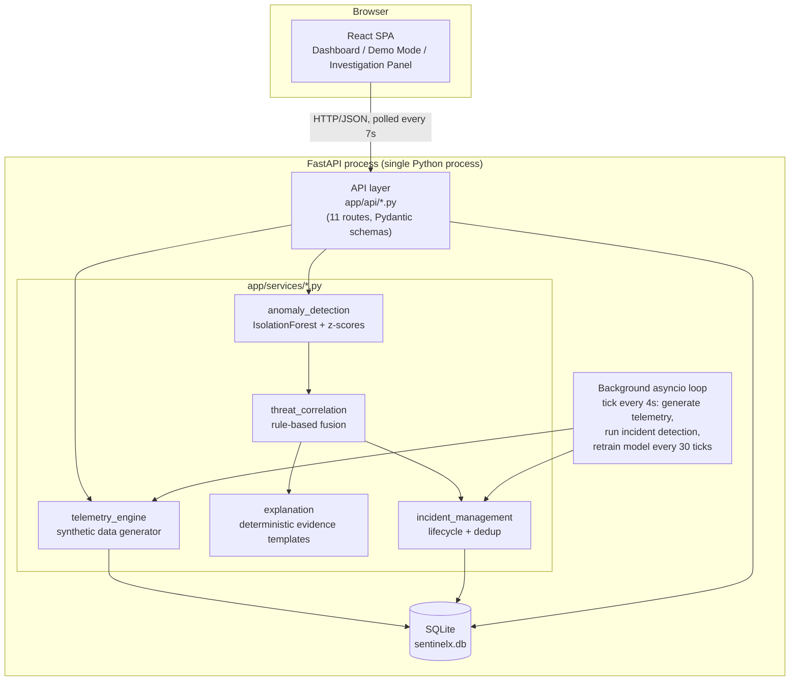
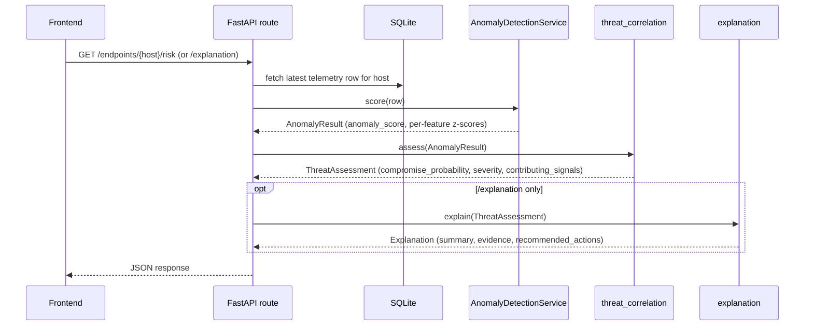
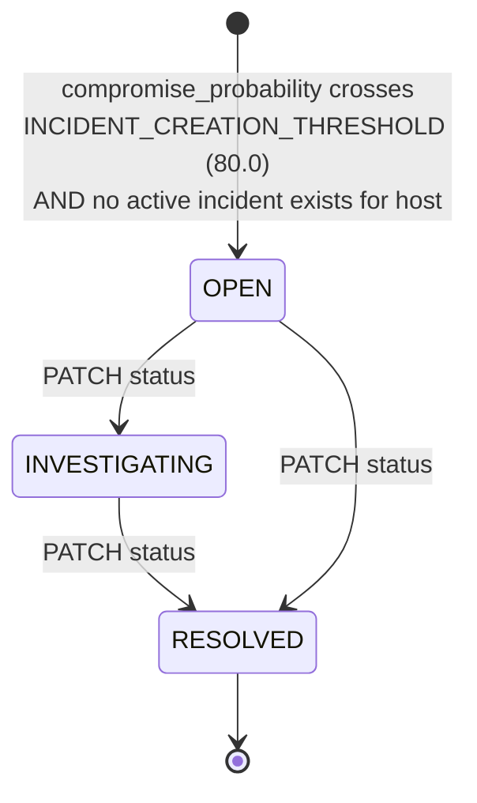

# SentinelX — System Architecture

SentinelX is a behavioural compromise detection platform for endpoints, firewalls, and routers.
This document details the system design, data flows, machine learning methodology, and API specifications.

## Table of contents

1. [Problem statement](#1-problem-statement)
2. [System overview](#2-system-overview)
3. [Architecture diagram](#3-architecture-diagram)
4. [Data flow](#4-data-flow)
5. [Telemetry schema](#5-telemetry-schema)
6. [ML pipeline](#6-ml-pipeline)
7. [Isolation Forest methodology](#7-isolation-forest-methodology)
8. [Behavioural baseline](#8-behavioural-baseline)
9. [Threat correlation](#9-threat-correlation)
10. [Explainability](#10-explainability)
11. [Incident lifecycle](#11-incident-lifecycle)
12. [API architecture](#12-api-architecture)
13. [Frontend architecture](#13-frontend-architecture)
14. [Simulation architecture](#14-simulation-architecture)
15. [Security considerations](#15-security-considerations)
16. [Current MVP limitations](#16-current-mvp-limitations)
17. [Future production architecture](#17-future-production-architecture)

---

## 1. Problem statement

Build a system that can determine whether a system, firewall, router, or network endpoint has
been compromised **without relying solely on known Indicators of Compromise (IoCs)** — i.e.
without signature or known-bad-hash matching. The differentiator is:

1. **Behavioural anomaly detection** — flag deviation from what is normal *for that specific
   host*, not deviation from a fixed global threshold or blocklist.
2. **Multi-signal correlation** — a single unusual metric is noise; a compromise indicator is
   several independent signal families moving together.
3. **Explainable threat reasoning** — every score must be traceable to concrete evidence
   (observed value, learned baseline, deviation), never a bare number.

All telemetry, endpoints, and incidents in this system are **synthetically generated**
and clearly labelled throughout the application.

## 2. System overview

SentinelX is built as a two-tier web application:

- **Backend**: Python 3.13 / FastAPI, SQLite, scikit-learn `IsolationForest`. Generates
  synthetic behavioural telemetry for 5 simulated hosts, scores it for anomalies, correlates
  signals into a compromise probability, generates a human-readable explanation, and manages a
  persisted incident lifecycle.
- **Frontend**: React 19 + TypeScript + Vite + Tailwind CSS v4 + Recharts. A SOC-style dashboard
  polling the backend every 7 seconds, an incident investigation drawer, and a scripted-but-real
  "Demo Mode" that walks a live compromise simulation end to end.

Everything — the 5 hosts, their telemetry, the "compromise" — is synthetic and explicitly labelled
as such in every API response (`notice` field) and in the UI. No real host, network, or user data
is collected or processed anywhere in this system.

## 3. Architecture diagram



The whole backend is **one Python process** — no message queue, no worker pool, no separate ML
service. `AnomalyDetectionService` is an in-memory singleton (`app/services/anomaly_detection.py`,
`anomaly_service` instance) trained at process startup and re-trained periodically by the same
background loop that generates telemetry.

## 4. Data flow

**CURRENT MVP.** Two independent flows exist:

**A — Telemetry generation (continuous, backend-internal)**

```mermaid
sequenceDiagram
    participant Loop as Background loop (every 4s)
    participant TE as telemetry_engine
    participant DB as SQLite (telemetry table)
    participant IM as incident_management

    Loop->>TE: tick_all_hosts()
    TE->>TE: per host: random-walk "load" + role profile → 12-field sample
    TE->>DB: INSERT telemetry row
    Loop->>IM: run_incident_detection()
    IM->>DB: score latest sample per host, open incident if threshold crossed
```

**B — On-demand scoring (triggered by any API read)**



There is no caching layer: every `/risk` or `/explanation` call re-scores the *current* latest
telemetry row from scratch. Scores are never pre-computed or stored except inside a persisted
`Incident` record (a point-in-time snapshot, not a live value).

## 5. Telemetry schema

**CURRENT MVP.** SQLite table `telemetry` (`app/db/database.py`):

| Column | Type | Notes |
|---|---|---|
| `id` | INTEGER PK | autoincrement |
| `hostname` | TEXT | FK → `endpoints.id` |
| `timestamp` | TEXT | ISO-8601 |
| `cpu_usage` | REAL | % |
| `memory_usage` | REAL | % |
| `network_connections` | INTEGER | count |
| `inbound_bytes` | INTEGER | bytes |
| `outbound_bytes` | INTEGER | bytes |
| `dns_queries` | INTEGER | count |
| `failed_logins` | INTEGER | count |
| `successful_logins` | INTEGER | count |
| `new_processes` | INTEGER | count |
| `unique_destinations` | INTEGER | count |
| `is_anomalous` | INTEGER (0/1) | **ground truth** from the simulation — used only to curate ML training data, never consulted at inference time (see §6) |

The 9 columns used as ML features (`FEATURES` in `anomaly_detection.py`) are: `cpu_usage`,
`memory_usage`, `network_connections`, `inbound_bytes`, `outbound_bytes`, `dns_queries`,
`failed_logins`, `new_processes`, `unique_destinations`. `successful_logins` is captured but not
used as a model feature.

**Simulated fleet** (table `endpoints`, seeded once at first startup):

| Host | Label | Type | Role profile (`HOST_PROFILES`) |
|---|---|---|---|
| HOST-001 | WIN10-FIN-01 | system | workstation, low baseline traffic |
| HOST-017 | WIN11-HR-17 | system | workstation, low baseline traffic |
| HOST-023 | PERIM-FW-023 | firewall | high connection/byte volume, near-zero interactive logins |
| HOST-042 | WIN10-ENG-42 | system | workstation — **default simulated-compromise target** |
| HOST-051 | CORE-RTR-051 | router | highest connection/byte volume, near-zero logins |

Normal telemetry is generated per-host from a smooth bounded random walk (`_next_load`, step
σ=0.015, bounds [0.3, 0.7]) so that CPU/memory/connections/DNS all drift together the way a real
host's load does — not independently, which would look unrealistically noisy. New rows are
appended every `TICK_SECONDS = 4` seconds by the background loop; `BACKFILL_POINTS = 60` rows per
host are generated once at first startup so the API has history immediately.

## 6. ML pipeline

**CURRENT MVP.** One service, `AnomalyDetectionService` (`app/services/anomaly_detection.py`),
with two operations:

- **`train(normal_rows)`** — called (a) once at process startup on all telemetry rows where
  `is_anomalous = 0`, and (b) every `RETRAIN_EVERY_N_TICKS = 30` ticks (~2 minutes) by the
  background loop, again on all rows currently labelled normal. Retraining lets the baseline
  absorb newly-observed-but-legitimate variation instead of staying frozen at the first 60-sample
  snapshot (this was added after observing false positives from an under-sampled baseline — see
  §16).
- **`score(row)`** — pure inference. Takes one telemetry row, returns an `AnomalyResult`
  (`anomaly_score` 0–100, `raw_isolation_score`, and a list of `FeatureDeviation`s sorted by
  |z-score|). Never touches `is_anomalous`.

The `is_anomalous` ground-truth label is used **exclusively** to select which rows belong in the
training set (`database.fetch_normal_telemetry_rows()` filters `WHERE is_anomalous = 0`). It is
never passed to the model and never read during `score()`. This is the honesty boundary that
makes the detection genuinely unsupervised at inference time.

## 7. Isolation Forest methodology

**CURRENT MVP.** `sklearn.ensemble.IsolationForest(n_estimators=200, max_samples="auto",
random_state=42)`, fit once per training call on a **pooled, per-host-normalized** feature matrix.

Pipeline, in order:

1. **Per-host baseline** — for each host in the training set, compute mean and standard
   deviation of each of the 9 features (`_compute_baseline`).
2. **Z-score normalization** — every row (training or inference) is converted to a 9-dimensional
   z-score vector using *that row's own host's* baseline (`_zscore_vector`), not a global one.
   This is what lets one model generalize across a firewall's ~200 connections/tick and a
   workstation's ~12: both normalize to "how many std-devs from this host's own normal", a
   comparable unit. Std is floored at `max(STD_FLOOR_ABS=0.5, STD_FLOOR_REL=0.02 × |mean|)` so a
   feature that happens to look constant in the training window doesn't produce a divide-by-near-
   zero blowup; the resulting z is additionally clipped to `Z_SCORE_CLIP = ±10`.
3. **Fit** — the forest is fit on the pooled z-score matrix from *all* hosts at once (one global
   model, not one per host).
4. **Raw score** — `raw = -model.score_samples(z_vector)` (sign-flipped so higher = more
   anomalous).
5. **0–100 normalization** — linear scale anchored on two statistics of the *training* raw-score
   distribution: the **median** maps to 0 ("typical" normal behaviour), the **maximum** maps to
   100 (the single most unusual point seen in the whole normal baseline), clipped beyond.

Step 5's specific anchoring was not the first thing tried. A plain percentile-rank calibration was
implemented first and rejected after live testing showed it made ordinary normal telemetry swing
wildly (0 to 83 out of 100) between successive ticks, because with only tens of samples per host
IsolationForest's raw scores for unremarkable points cluster in a narrow band, and percentile rank
amplifies tiny differences within that band into large swings. The median/max anchoring is
documented in the code (`_normalize_score` docstring) specifically as a rejected-alternative
writeup, not just a design choice.

**Known, documented limitation** (see §16): with only tens of training samples per host,
IsolationForest reliably detects anomalies that are extreme across *several* dimensions at once,
but is measurably weaker at detecting an anomaly confined to a single dimension out of nine — this
was found and characterized during development (`tests/test_anomaly_detection.py`), and is the
reason the correlation layer (§9) exists as a second, independent signal rather than trusting the
ML score alone.

## 8. Behavioural baseline

**CURRENT MVP.** "Baseline" in this system means, precisely: the per-host, per-feature `(mean,
std)` computed from that host's own telemetry rows labelled normal at training time
(`AnomalyDetectionService._host_baselines`). There is one baseline dictionary per host, keyed by
hostname; a `_global_baseline` (pooled across all hosts) is kept only as a fallback for a
hostname the model has never seen.

This is why the same raw traffic volume is not anomalous or anomalous in a vacuum — it is judged
strictly against *that host's own history*. A firewall's normal ~200 connections/tick would be an
extreme, multi-σ outlier if evaluated against a workstation's baseline of ~12; scored against its
own baseline, it is unremarkable. This was directly tested
(`tests/test_anomaly_detection.py::test_same_raw_traffic_is_normal_for_host_b_but_anomalous_for_host_a`).

Baselines are recomputed every retrain (§6), so they are not static — they track the most recent
window of confirmed-normal telemetry.

## 9. Threat correlation

**CURRENT MVP.** `app/services/threat_correlation.py` — a transparent, rule-based fusion layer
combining the ML anomaly score with the raw per-feature z-scores into a single
`compromise_probability`. Explicitly documented in the module as **heuristic weights, not values
fitted or validated against a labelled dataset**.

- A feature is "significant" if `|z_score| ≥ Z_SIGNIFICANCE_THRESHOLD = 2.0`.
- Correlation breadth/severity only contribute if **at least
  `MIN_CORRELATED_SIGNALS_FOR_BOOST = 2`** features are simultaneously significant — a single
  drifting metric (common with 9 tracked features) does not by itself move the score. This gate
  was added after observing single-feature noise inflate scores during live testing.
- Formula:
  `compromise_probability = 0.5×anomaly_score + 0.3×correlation_breadth×100 + 0.2×severity_factor×100`,
  where `correlation_breadth = min(significant_count / 9, 1)` and `severity_factor =
  min(mean(|z| of significant features) / 6.0, 1)`.
- Severity label from the same 0–100 score: **critical ≥ 75, high ≥ 50, medium ≥ 25, else low**
  (`SEVERITY_THRESHOLDS`).
- Top `MAX_CONTRIBUTING_SIGNALS = 5` significant features (by |z|) are returned as
  `contributing_signals` for the API/UI.

## 10. Explainability

**CURRENT MVP.** `app/services/explanation.py` — a **deterministic template generator**, not an
LLM call. No LLM API is configured for this project, so this is the actual implementation, not a
fallback path.

- **Evidence** — one entry per significant contributing signal: `signal` (human label, e.g.
  `outbound_traffic`), `observed`, `baseline` (mean), `baseline_range` (mean ± std),
  `deviation` (z-score), `deviation_pct`, `contribution` (% share of total evidence weight,
  computed from |z| so all entries sum to ~100%), `direction`, and a per-signal `severity` bucket
  (`moderate` <4σ, `high` <7σ, `severe` ≥7σ — `_SEVERITY_BUCKETS`).
- **Summary** — built from a fixed template listing the ranked evidence, always ending with an
  explicit disclaimer sentence stating the finding is a behavioural indicator, not a confirmed
  attribution.
- **Recommended actions** — looked up from a fixed `SIGNAL_ACTIONS` map keyed by which signal
  categories actually deviated (e.g. `outbound_bytes` → "Inspect outbound network connections…"),
  plus universal isolate/preserve-evidence actions gated to high/critical severity only, and a
  "continue monitoring" action when nothing deviates.

**Hard constraint, enforced by construction, not by instruction**: there is no code path anywhere
in `explanation.py` that can emit a malware family name, CVE identifier, threat-actor name, or
specific attack-technique name. The vocabulary is a fixed, hand-written mapping from raw telemetry
feature name to generic behavioural label. This is verified by
`tests/test_explanation.py::test_explanation_never_contains_fabricated_attribution`, which checks
API output against a list of forbidden terms (`cve-`, `trojan`, `ransomware`, `cobalt strike`, …).

## 11. Incident lifecycle

**CURRENT MVP.** SQLite table `incidents`, managed by `app/services/incident_management.py`.



- **Creation trigger**: `run_incident_detection()`, called (a) every background tick and (b)
  synchronously inside `POST /simulation/compromise` for immediate feedback. It scores every
  host's latest telemetry; if `compromise_probability ≥ INCIDENT_CREATION_THRESHOLD = 80.0` **and**
  no existing incident for that host has status `OPEN` or `INVESTIGATING`
  (`get_active_incident_for_host`), a new incident is inserted with a snapshot of severity,
  scores, the full `Explanation` (summary + evidence + actions, serialized as JSON), and status
  `OPEN`.
- **80.0, not 50 ("high") or 75 ("critical")** — this threshold was tuned empirically during
  development, not guessed. It was raised twice after live observation: telemetry's realistic
  *correlated* random-walk noise (§5, §7) occasionally pushed several signals past the
  correlation gate together by chance, briefly reaching 50–76% with no genuine anomaly. A real
  simulated compromise reliably scores 90–100% (§14), so 80.0 keeps a wide safety margin. This is
  documented in the module docstring as an accepted, ongoing tuning tradeoff, not a claim of zero
  false positives.
- **No auto-resolution.** Nothing in the codebase closes an incident based on telemetry
  improving — `POST /simulation/reset` restores normal telemetry but leaves any existing incident
  exactly as it was. Only an explicit `PATCH /incidents/{id}` (human action, or the frontend's
  Demo Mode reset helper) changes status. This mirrors real SOC ticketing: detection opens a case,
  a person closes it.
- **Deduplication**: the "no active incident already exists" check is the entire dedup mechanism
  — verified directly by `tests/test_incidents.py::test_repeated_compromise_calls_do_not_duplicate_incidents`.

## 12. API architecture

**CURRENT MVP.** FastAPI, all routes under `/api`, all response bodies Pydantic models
(`app/api/schemas.py`), CORS restricted to `http://localhost:5173` /
`http://127.0.0.1:5173` (`app/core/config.py`). Every list/detail response includes a `notice`
field restating that the data is synthetic.

| Method | Path | Purpose |
|---|---|---|
| GET | `/api/health` | liveness/version |
| GET | `/api/endpoints` | list the 5 simulated hosts |
| GET | `/api/endpoints/{hostname}` | single host detail |
| GET | `/api/telemetry/{hostname}` | telemetry history (`limit` query param) |
| GET | `/api/endpoints/{hostname}/risk` | live anomaly + correlation score |
| GET | `/api/endpoints/{hostname}/explanation` | live evidence-based explanation |
| GET | `/api/incidents` | list incidents (`status` filter) |
| GET | `/api/incidents/{incident_id}` | single incident |
| PATCH | `/api/incidents/{incident_id}` | change status (OPEN/INVESTIGATING/RESOLVED) |
| POST | `/api/simulation/compromise` | trigger simulated compromise (`hostname` query param, default `HOST-042`) |
| POST | `/api/simulation/reset` | restore all hosts to normal telemetry |

11 routes total, confirmed by direct inspection of the route decorators at doc-writing time. No
authentication, no rate limiting, no versioning scheme beyond the `/api` prefix (see §15, §16).

## 13. Frontend architecture

**CURRENT MVP.** React 19 + TypeScript, Vite 8 build, Tailwind CSS v4 (via `@tailwindcss/vite`),
Recharts 3 for all charts. No router library — view switching (`Dashboard` / `Demo Mode`) is a
single `useState` in `App.tsx`. No global state manager — all server state lives in three custom
hooks:

- **`useDashboardData`** — fetches `/endpoints`, `/risk` for all 5 hosts in parallel, and
  `/incidents`; polls every `POLL_INTERVAL_MS = 7000` ms; exposes `simulateCompromise()` /
  `resetSimulation()` which call the API then immediately refetch.
- **`useTelemetryTimeline`** — fetches telemetry for all hosts and buckets anomalous-vs-total
  counts by timestamp, for the Threat Activity Timeline chart.
- **`useInvestigation`** — fetches risk + explanation + telemetry for one selected host, used by
  the investigation drawer.
- **`useDemoSequence`** — orchestrates Demo Mode (§14).

**Component tree**: `App` → `Header` (mode toggle, Simulate/Reset controls) → either the
`Dashboard` view (`ValueProps`, `SummaryCards`, `ThreatTimelineChart`, `RiskDistributionChart`,
`RecentIncidents`, `EndpointTable`) or `DemoMode`; `InvestigationPanel` renders as an overlay on
top of either view when a host is selected.

**Status vocabulary**: the backend's 4-tier severity (`low`/`medium`/`high`/`critical`) is used
verbatim in detail views (`SeverityBadge`), and collapsed to a 3-tier **Normal / Suspicious / High
Risk** vocabulary (`lib/severity.ts::statusTier`) for at-a-glance scanning (endpoint table, Demo
Mode pills), each with a fixed color reused nowhere else in the UI.

**Accessibility**: endpoint table rows are real keyboard targets (`role="button"`, `tabIndex`,
Enter/Space handlers); the investigation panel is `role="dialog"` with `aria-modal`, auto-focuses
its close button on open, and closes on Escape; the simulation status banner is
`aria-live="polite"`.

**Design tokens**: a dark, restrained palette taken from a validated accessible reference palette
(fixed status colors: green/amber/orange/red for the 4 severity tiers, reused nowhere else),
defined as CSS custom properties in `index.css`.

## 14. Simulation architecture

**CURRENT MVP.** Two layers: the backend simulation primitive, and the frontend's guided replay
of it.

**Backend** (`telemetry_engine.py`, `simulation_state` table): a host is either normal or
compromised (boolean + timestamp, per host). `POST /simulation/compromise` sets the flag and
**immediately generates one real anomalous telemetry sample** via `_apply_compromise` — every
targeted feature is shifted (e.g. `outbound_bytes` × uniform(6,15) + a flat
addend; `dns_queries` × uniform(4,9) + 5; `new_processes` += randint(4,12); `failed_logins` +=
randint(3,10); `cpu_usage`/`memory_usage` += 15–35 points) across six key signal families
(outbound traffic, DNS, process creation, authentication, destination diversity, resource
usage). While the flag is set, every subsequent
background tick for that host also generates anomalous telemetry, so the host stays
"compromised" until reset. `POST /simulation/reset` clears the flag for every host and generates
one fresh normal sample per host that was compromised.

**Frontend Demo Mode** (`useDemoSequence.ts`): a guided walkthrough for a live presentation.
Every stage executes a real API call against the
running backend, revealed with readable pacing (`STAGE_PAUSE_MS = 1100` ms).
Sequence: reset → trigger compromise → fetch telemetry → fetch risk
(evaluating anomaly detection and multi-signal correlation) → fetch incidents → fetch explanation.
A "Reset Demo" action additionally resolves any OPEN/INVESTIGATING incident left on the demo host so
subsequent runs start from a clean baseline.

## 15. Security considerations

**Security Controls in Place:**

- All request/response bodies are validated through Pydantic models; invalid input is rejected
  with `422` before reaching any handler logic.
- All SQLite access goes through parameterized queries (`app/db/database.py`) — preventing SQL injection.
- CORS is restricted to the known local dev origins.
- No destructive or offensive capability exists anywhere in the codebase. "Compromise" is
  entirely synthetic telemetry generation; no real exploitation or network scanning occurs.
- No secrets, credentials, or API keys are required or stored — the system operates fully self-contained.
- All responses carry an explicit synthetic-data notice.

## 16. Current Limitations

- **Authentication / Authorization:** Intended for local prototype demonstration; production deployment requires RBAC and JWT authentication.
- **Single Process & Database:** Currently runs as a single FastAPI process with local SQLite; production scale requires PostgreSQL / TimescaleDB and asynchronous message queues (Kafka).
- **Synthetic Telemetry:** Telemetry is generated via statistical modeling rather than live network packet capture (eBPF / Zeek).
- **Evaluation:** Tested extensively against synthetic scenarios with 53 automated tests; real-world deployment requires benchmarking against benchmark threat datasets (e.g. UNSW-NB15 / CIC-IDS).
- **False positives are reduced, not eliminated.** The 80.0 incident threshold (§11) and the
  2-signal correlation gate (§9) were both raised in response to observed noise from the
  telemetry generator's own realistic (correlated, non-independent) random walk — occasional
  transient "medium"/"high" readings on an untouched host, self-correcting within seconds, remain
  possible and were reproduced and documented during verification testing.
- **Correlation-layer weights are heuristic**, not fitted or validated against a labelled
  dataset — stated in the code itself (§9).
- **No time-series storage of risk scores.** `/risk` is always computed fresh from the latest
  telemetry row; historical risk is not persisted (only telemetry history and incident snapshots
  are).
- **Frontend uses polling (7s), not push.** No WebSocket/SSE channel exists.
- **Demo Mode targets a single hardcoded host** (`HOST-042` by default) — it is a presentation
  tool, not a general-purpose multi-host simulator.
- **No retraining convergence guarantee.** Periodic retraining (§6) reduces but does not
  mathematically guarantee elimination of the small-sample effects described above.
- **No structured audit log**, no alerting/notification integration (email, Slack, SIEM/SOAR),
  and no multi-tenant concept — this is a single simulated fleet.
- **Large frontend JS bundle** (~660 KB uncompressed, ~198 KB gzipped) — Recharts is not
  code-split; noted as a build warning, not fixed.

## 17. Future production architecture

None of the following is implemented. This is a plan, explicitly separated from the above.

- **Real telemetry ingestion**: lightweight host agents / EDR integration / network tap or NetFlow
  collectors feeding a streaming ingestion layer (e.g. Kafka or a managed equivalent), replacing
  the synthetic generator.
- **Proper time-series storage** (e.g. TimescaleDB, InfluxDB, or a columnar store) for telemetry
  and historical risk scores, instead of SQLite rows queried per-request.
- **Model evaluation program**: a held-out labelled dataset (real or red-team-generated) with
  measured precision/recall/F1 and a documented methodology, before any accuracy claim is made
  publicly. Continuous drift monitoring and scheduled retraining with approval gates, not just a
  fixed tick-count trigger.
- **Ensemble / richer modelling**: complementing IsolationForest with a supervised classifier
  trained on analyst-confirmed incident outcomes (closing the loop the current INVESTIGATING →
  RESOLVED status transitions don't yet feed back into), and/or sequence models for temporal
  attack patterns the current single-sample scoring cannot see.
- **Multi-tenant baselines and RBAC**: per-organization data isolation, role-based access
  (analyst/admin/read-only), SSO integration.
- **Real-time push** to the frontend (WebSocket/SSE) instead of polling.
- **Horizontal scaling**: stateless API layer behind a load balancer, the ML scoring service
  extracted into its own horizontally-scalable component, a real message queue between ingestion
  and scoring.
- **Alerting/SOAR integration**: outbound webhooks or connectors to Slack, PagerDuty, a SIEM, or a
  SOAR platform when an incident opens, plus the option to route recommended actions into existing
  ticketing systems.
- **Audit logging** of every status change, every API call that mutates state, and every model
  retrain, with immutable storage.
- **Encryption at rest and in transit**, secrets management, and a real authentication/
  authorization layer (OAuth2/OIDC) in front of every route.
- **Containerized, orchestrated deployment** (Docker images, Kubernetes or equivalent), CI/CD with
  automated test/build/lint gates matching what is already run manually in this repo.
